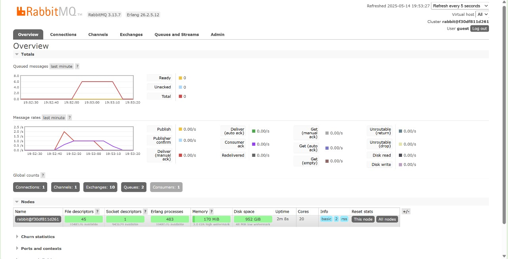

a. What is `amqp`?
AMQP (Advanced Message Queuing Protocol) is an open-standard protocol for secure and reliable asynchronous messaging. The purpose is to enable applications/systems to exchange messages via a central broker. It guarantees message delivery, supports routing, and works in distributed environments.

b. What does it mean?  `guest:guest@localhost:5672` , what is the first guest, and what is the second guest, and what is `localhost:5672` is for?
The first `guest` is a RabbitMQ username (default), the second `guest` is the password. The `localhost:5672` specifies the network address and port where the AMQP broker is running

###Simulation slow subscriber

On my machine, the total queue count reached 6. This occurred because the subscriber takes more time to process each event in the message queue, causing messages to accumulate as the publisher sends them faster than the subscriber can handle.